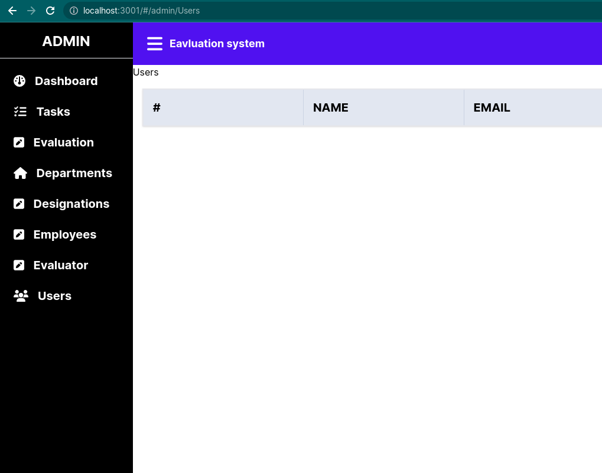

# react-router-map

## How to use

Installation

```sh
# Pnpm
pnpm install react-router-map
# Npm
npm install react-router-map
#Yarn
yarn add react-router-map
```

To load it in your component ensure `react-router-dom` is installed

Supports both `esm` and `commonjs`

```jsx
import { MapRouter } from 'react-router-map'
import { IRouteProps } from 'react-router-map/dist/esm/types' //Types of route for esm modules

const Child1 = () => <div>Child 1</div>
const Child2 = () => <div>Child 2</div>
const Parent1 = () => <div>Child 2</div>
const Parent1 = () => <div>Child 2</div>
const routes: IRouteProps[] = [
  {
    pathName: 'Home',
    urlPath: '/',
    Component: <Parent1 />,
    hasChildren: false,
  },
  {
    pathName: 'Home',
    urlPath: '/',
    Component: <Parent2 />,
    hasChildren: false,
  },
]
const Comp = () => (
  <div>
    <MapRouter routes={routes} enableTopScroll={false} browserRouter={false} />
  </div>
)
```
The code above implements `HashRouter` and `BrowserRouter` for you and you just need to install the package and `react-router-dom`
Features
- Optional topscroll on page navigation
- Enable BrowserRouter or disable( Defaults to `HashRouter`) 
- Nested layouts (You just have to to supply any level of nesting in your Application in the `nestedComponents` property)
Upcoming features
 - Layout support

 In the mean time we can inject a wrapper in the route `Component` property

Supports nested layouts

